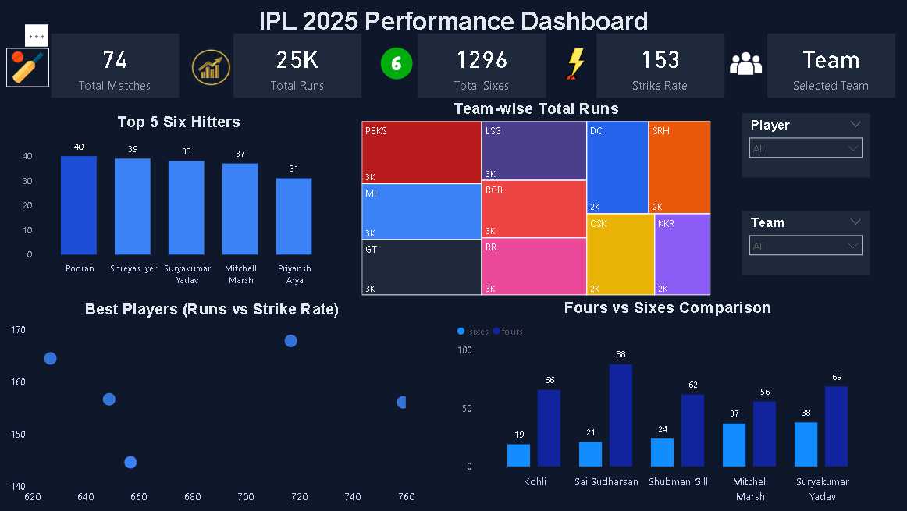

# IPL 2025 Performance Dashboard
## Dashboard Preview

## Project Overview

This Power BI dashboard provides a comprehensive analysis of IPL 2025 player and team performance. The project uses interactive visualizations to explore batting and bowling statistics, helping users identify top performers and key tournament trends.

## Key Features

* Team-wise performance analysis
* Top run scorers and six hitters
* Strike rate comparison
* Top wicket takers
* Economy rate analysis
* Dot ball performance analysis
* Interactive player and team filters

## Tools & Technologies

* Power BI
* Power Query
* DAX
* Microsoft Excel / CSV

## Dashboard Insights

* Batting performance metrics including runs, strike rate, fours, and sixes.
* Bowling performance metrics including wickets, economy rate, and dot balls.
* Team-wise comparisons through dynamic visualizations.
* Interactive filtering for deeper analysis.

## Skills Demonstrated

* Data Analysis
* Data Visualization
* Dashboard Development
* KPI Reporting
* DAX
* Power BI
